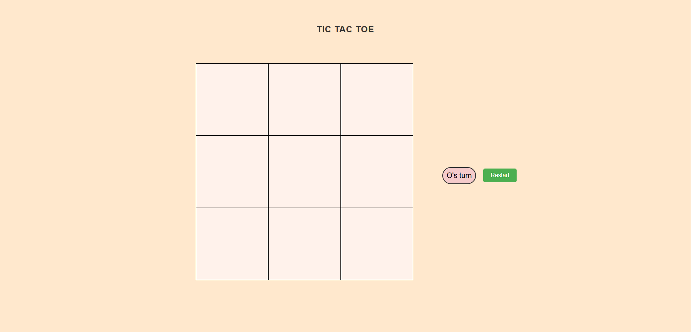

# 🎯 Tic Tac Toe Game

A simple and responsive **Tic Tac Toe** game built using **HTML**, **CSS**, and **JavaScript**.  
Play against a friend locally and enjoy a smooth, interactive UI — works on both desktop and mobile.

---

## 📌 Features

- ✅ **Two Player Mode** — Play with your friend on the same device  
- 🎨 **Responsive Design** — Works seamlessly on mobile and desktop  
- ⚡ **Fast Gameplay** — No lag, instant moves  
- 🖌 **Attractive UI** — Clean, minimalistic design  
- 📢 **Winner Announcement** — Displays the winner or a draw pop-up  

---

## 📂 Project Structure

📦 TicTacToe
├── index.html # Main HTML file
├── style.css # Styling (responsive + design)
├── script.js # Game logic & interactivity
└── README.md # Project documentation

---

## 🎮 How to Play

1. **Open** the game in your browser.  
2. **Player X** starts first.  
3. Players take turns clicking on empty boxes.  
4. First to get **3 in a row** (horizontally, vertically, or diagonally) wins.  
5. If all boxes are filled without a winner — it's a **Draw**.  

---

## 🛠 Technologies Used

- **HTML5** – Structure  
- **CSS3** – Styling & Responsive Design  
- **JavaScript (ES6)** – Game logic and DOM manipulation  

---

## 📷 Screenshots

---

## 🚀 Live Demo

🔗 [Play Now](https://anik071.github.io/tic-tac-toe/)  

---

## 📜 License

This project is open source and available under the **MIT License**.

---

### 💡 Future Improvements
- Add **AI opponent** (single-player mode)
- Add **score tracking**
- Add **themes & animations**

---

### 👨‍💻 Author
**Abdul Kader Anik**  
📧 Email: anik.232071071@smuct.ac.bd
🌐 GitHub: [anik071](https://github.com/anik071)
